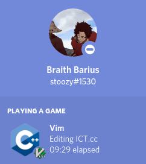

<!-- Pre-requisites -->
# VIMCORD
 

[](https://github.com/qwertyquerty/pypresence)
## INSTALLATION

You may use any vim package manager of your choice.

### VIM-PLUG
Place this in your `.vimrc`:

`Plug 'Stoozy/vimcord'`

… then run the following in Vim:
```
:source %
:PlugInstall
```

### VUNDLE

Place this in your `.vimrc`:

`Plugin 'Stoozy/vimcord'`

… then run the following in Vim:
```
:source %
:PluginInstall
```

For Vundle version < 0.10.2, replace Plugin with Bundle above.

### NEOBUNDLE

Place this in your `.vimrc`:

`NeoBundle 'Stoozy/vimcord'`

… then run the following in Vim:
```
:source %
:NeoBundleInstall
```

### Pathogen

Run the following in a terminal:

```
cd ~/.vim/bundle
git clone https://github.com/Stoozy/vimcord
```


## Configuration

Set `g:vimcord_show_workspace` to false to disallow showing the current workspace in the RPC. (This is true by default).

`let g:vimcord_show_workspace = 'false'`


